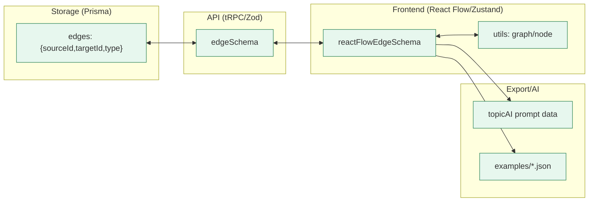

# Design Document

## Introduction

This design implements “Edge Direction Standardization” for Topic diagrams per 1-1.requirements.md. All edges will be represented as source → target across storage, API, UI, and exports. Relation labels will uniformly describe how the source relates to the target with a single canonical set. We preserve current visual layout (problems above, solutions below, effects relative) by allowing the layout to virtually flip during ranking only if needed. We also replace parent/child terminology with incoming/outgoing (graph) and above/below (layout). Scope spans Prisma, tRPC/Zod, frontend store and utilities, Topic AI, examples, and tests.

## Alternatives

- ALT-001: Keep current direction but rename terms — rejected; confusion persists in add flows and filtering, and duplicates remain (REQ-001/002).
- ALT-002: Support both directions with boundary normalization — rejected; higher complexity and drift risk; one canonical representation is preferred (REQ-001).
- ALT-003: Change labels only — rejected; still contradicts common graph/React Flow conventions (REQ-001).

## Relevant Existing Code

We will build on current patterns and adjust types, helpers, and comments to canonicalize direction and labels.

Mermaid overview of current and target flow:

Key files to change:

- src/common/edge.ts — relationNames; Zod schemas (edgeSchema, reactFlowEdgeSchema). Remove reverse-direction notes; update canonical set (REQ-001/002). Provide mapping utility for migration/back-compat.
- src/web/topic/utils/graph.ts — traversal helpers use parent/child and ancestors/descendants terms. Rename to incoming/outgoing and upstream/downstream; logic continues to rely on edge.source/edge.target (REQ-003).
- src/web/topic/utils/node.ts — parents/children helpers and neighbors to be renamed to incomingNeighbors/outgoingNeighbors or above/below for layout (REQ-003).
- src/web/topic/diagramStore/store.ts — relies on React Flow’s source/target already; ensure selectors and filters don’t assume reverse semantics; bump persist version and delegate migrations to migrate.ts (REQ-001/004/005).
- src/web/topic/utils/apiConversion.ts — ensure conversion preserves sourceId/targetId; add importer upgrade path for legacy JSON (REQ-001/005).
- src/api/routers/topic.ts — Zod schemas; ensure only canonical labels are accepted, remove comments implying target→source (REQ-001/002/005).
- src/api/topicAI.ts — export edges in canonical direction and labels; continue to filter justification relations (REQ-006).
- src/db/schema.prisma — keep enum stable initially; data migration remaps labels/directions; optional enum clean-up deferred (REQ-002/005).
- examples/\* — regenerate to canonical (REQ-006).
- e2e/tests and unit tests — update expectations (REQ-005/006).

### Files

- src/common/edge.ts: update relationNames and schema descriptions; add canonicalization map and function; export canonical sets.
- src/web/topic/utils/graph.ts: rename types and functions; keep traversal using source/target and new Direction terms.
- src/web/topic/utils/node.ts: rename helpers; introduce layout-oriented above/below naming where appropriate.
- src/web/topic/diagramStore/migrate.ts: add a versioned step to canonicalize any legacy persisted edges.
- src/web/topic/utils/apiConversion.ts: add legacy import detector and upgrader; ensure convertToApiEdge is pass-through of canonical direction.
- src/api/routers/topic.ts: enforce canonical label enum; keep solidifyParts logic unchanged for ids; optional telemetry.
- src/api/topicAI.ts: canonicalize outgoing payload; maintain justification filtering.
- scripts/generateMigration.ts + new SQL/TS migration under src/db/migrations/\*: implement idempotent data rewrite.
- design-docs/vocabulary.md and design-docs/diagram-rendering.md: update terminology.

### Dependencies

- React Flow (xyflow): Already uses source/target; no API changes. Using canonical direction aligns with best practices.
- Zustand, zundo, persist: Store version bump and migrate step to rewrite local persisted edges if needed.
- tRPC + Zod: Continue to use sourceId/targetId. Remove reverse-direction docstrings; enforce canonical label enum.
- Prisma: Data migration to remap Edge.type and flip sourceId/targetId for specific deprecated relations.

## Implementation concerns

- RISK-001: Double-flip during migration. Mitigation: migration function first probes whether an edge is already canonical based on label/direction and only transforms when necessary; track a migration version in a lightweight metadata table or mark in a Sentry breadcrumb with counts (idempotent). (REQ-005, REL-001)
- RISK-002: Enum churn. Mitigation: keep existing enum values; map deprecated to canonical labels in data; optionally prune enum in a later release after code and data are fully canonical. (REQ-002)
- RISK-003: Layout visual drift. Mitigation: preserve ranking rules; if virtual flip is needed, do it within layout only and never leak to storage/UI. Add layout snapshot comparisons in e2e for a representative topic. (REQ-004)
- ASSUMPTION-001: Downloaded topic JSON uses reactFlowEdgeSchema today; we will maintain file shape but ensure it contains canonical direction/labels. (REQ-001)
- ASSUMPTION-002: No runtime consumers rely on old reverse semantics beyond helper names; renames will be internal, with updated call sites. (REQ-003)

## Testing strategy

- TEST-001 (Unit): Canonicalization map cases
  - createdBy → causes, swap source/target
  - creates → causes, same direction
  - subproblemOf → has, swap
  - obstacleOf → impedes, same
  - Ensure no-ops for already-canonical labels.
- TEST-002 (Unit): Legacy importer detects old schema hint/version and upgrades to canonical edges in-memory.
- TEST-003 (Unit): Graph traversal with new incoming/outgoing names returns same sets as pre-change for a fixed sample graph.
- TEST-004 (E2E): Add flows produce canonical edges; Incoming/Outgoing counts correct across problem/solution/effect nodes.
- TEST-005 (E2E): Visual ordering parity — problems at top, solutions bottom, effects relative; screenshots compared within tolerance.
- TEST-006 (API): topic.createParts accepts canonical; topicAI exports canonical; justification filtering unchanged.

## Implementation Steps

### Phase 1

- GOAL-001: Canonicalize types, labels, and terminology.

| Task     | Description                                                      | Completed | Date |
| -------- | ---------------------------------------------------------------- | --------- | ---- |
| TASK-001 | Update src/common/edge.ts relationNames and schema docs          |           |      |
| TASK-002 | Add canonicalization utilities and mapping tables                |           |      |
| TASK-003 | Rename traversal helpers and terms in utils/graph and utils/node |           |      |

#### Files to update

- src/common/edge.ts: implement canonical set and mapping helper; update zod descriptions to remove reverse note.
- src/web/topic/utils/graph.ts: RelationDirection → Direction: "incoming" | "outgoing"; ancestors/descendants → upstream/downstream; update usage sites.
- src/web/topic/utils/node.ts: parents/children → incomingNeighbors/outgoingNeighbors; add above/below where layout-oriented.

#### Relevant pseudo-code or algorithms [optional]

##### Canonicalization mapping

function canonicalize(edge):

- let { source, target, label } = edge
- switch (label):
  - case 'createdBy': label = 'causes'; [source, target] = [target, source]; break
  - case 'creates': label = 'causes'; break
  - case 'subproblemOf': label = 'has'; [source, target] = [target, source]; break
  - case 'obstacleOf': label = 'impedes'; break
  - default: if label not in canonicalSet -> throw or map via synonym table
- return { ...edge, source, target, label }

### Phase 2

- GOAL-002: Migrations, imports, tests, and examples.

| Task     | Description                                               | Completed | Date |
| -------- | --------------------------------------------------------- | --------- | ---- |
| TASK-004 | Write Prisma/data migration to remap edges                |           |      |
| TASK-005 | Add store migrate() step to rewrite legacy persisted data |           |      |
| TASK-006 | Implement legacy JSON auto-upgrade on import/download     |           |      |
| TASK-007 | Update Topic AI export paths and docs                     |           |      |
| TASK-008 | Refresh examples and update e2e/unit tests                |           |      |

#### Files to update

- scripts/generateMigration.ts + new migration in src/db/migrations/: idempotent rewrite (flip + rename) with counters; optional Sentry logging.
- src/web/topic/diagramStore/migrate.ts: increment version; apply canonicalize() to all edges if not marked canonical.
- src/common/topic.ts: sanitize edges to canonical before download; detect and upgrade on upload.
- src/api/topicAI.ts: ensure edgesToCreate reflect canonical set and direction.
- examples/\*: update with new export.
- e2e/tests/\*.spec.ts: update assertions and snapshots.

## Canonical relation set (explicit) (REQ-002)

- Topic: causes, has, addresses, accomplishes, contingencyFor, criterionFor, fulfills, impedes, mitigates
- Research/Justification (unchanged semantics, already source→target): asksAbout, potentialAnswerTo, relevantFor, sourceOf, mentions, supports, critiques

Deprecated → Canonical mapping for migration/import:

- subproblemOf → has (flip direction)
- createdBy → causes (flip direction)
- creates → causes (same direction)
- obstacleOf → impedes (same direction)

## Effect placement algorithm (layout parity) (REQ-004)

Maintain current effect positioning relative to problems and solutions while adopting canonical edges.

Algorithm sketch:

1. For each Effect node E, compute upstream nodes via incoming traversal limited to causal-ish relations: ['causes','impedes','mitigates','addresses','accomplishes'].
2. If any upstream Problem found → mark problem-based. If any upstream Solution/Mitigation found → mark solution-based.
3. Placement: both → middle; problem-only → top; solution-only → bottom; none → middle (default).

This uses the renamed upstream traversal helper and is internal to layout, not changing stored edges or UI semantics.
