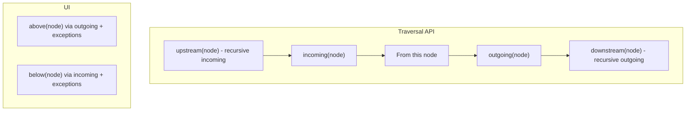

# Design Document

## Introduction

This design implements edge direction standardization, relation label consolidation, and traversal/layout terminology refactors across the topic diagram domain. It fulfills requirements REQ-001 through REQ-006 plus associated acceptance criteria by:

- Migrating database enum values and persisted diagram store data to canonical relation names and directions (source → target semantics everywhere).
- Collapsing legacy labels (`subproblemOf`, `createdBy`, `creates`, `obstacleOf`) into canonical labels with appropriate direction normalization (`subproblemOf` + `createdBy` reversed; `creates` → `causes`; `obstacleOf` → `impedes`).
- Replacing traversal nomenclature (parent/child/ancestor/descendant) with incoming/outgoing (immediate) and upstream/downstream (recursive) plus explicit above/below semantics for UI handles, using fixed exception rules independent of layout engine output.
- Preserving visual layering (node vertical ordering) without changing user mental model (REQ-003) by adapting layout input (per-edge orientation option investigation; fallback to pre-layout directional transforms only if needed) while storing canonical directions.
- Updating hidden neighbor indicator logic to rely on the new directional APIs and consistent above/below inference (REQ-004).
- Ensuring legacy imports auto-normalize on load while canonical exports remain unchanged (REQ-006).

The implementation is phased to minimize refactor churn and keep each step testable. Phases 1–5 cover: migration, traversal refactor, hidden neighbor logic, layout invariance, and documentation/code comment updates. Testing is integrated within each phase—no trailing omnibus phase per guidance.

## Alternatives

- **ALT-001**: Dual-mode compatibility layer (support both legacy and canonical schemas simultaneously) - rejected because requirement 5.6 specifies no backward compatibility; complexity and risk outweigh benefit.
- **ALT-002**: Pure visual inversion (leave stored edge directions mixed; only flip arrowheads in the renderer) - rejected as it preserves mental model inconsistency and complicates traversal & analytics (contradicts REQ-001 rationale).
- **ALT-003**: Introduce wrapper traversal APIs while deprecating old names (soft migration) - rejected per clarification: rename outright; no wrappers, to avoid code bloat and drift risk.
- **ALT-004**: Snapshot-based layout regression (serialize full layout output) - rejected per clarification; deterministic node-type vertical ordering assertions suffice and avoid brittle snapshots.

## Relevant Existing Code

Key areas affected:

- `src/common/edge.ts` (relation enums, schema descriptions; remove note about reverse semantics).
- Prisma schema: `schema.prisma` (enum EdgeType; add canonical values, remove legacy).
- Data migration scripts & SQL generation utilities in `scripts/` (new forward + down migration pair; single transaction, raw SQL for enum value surgery).
- Diagram store: `src/web/topic/diagramStore/store.ts` (version bump & data migration function for persisted store JSON & in-browser local storage).
- Traversal utilities: `src/web/topic/utils/graph.ts`, `src/web/topic/utils/node.ts` (remove `parents/children/ancestors/descendants`; add `incoming`, `outgoing`, `upstream`, `downstream`).
- New above/below helpers (new file `src/web/topic/utils/direction.ts` or consolidated into `graph.ts`) encapsulating exception rules.
- Hidden neighbor & handle logic: `src/web/topic/components/Node/NodeHandle.tsx`, `src/web/topic/diagramStore/nodeHooks.ts` (update to new direction APIs and above/below logic).
- Edge addition / connectable logic: `useConnectableNodes` in `nodeHooks.ts` referencing directional roles.
- Layout pipeline: `src/web/topic/utils/layout.ts` (investigate per-edge orientation config; fallback transformation adapter if needed).
- Import/export: `src/web/topic/diagramStore/loadStores.ts` (actual file referenced in requirements `loadStores.ts`; verify path), plus any JSON schema or export helpers using legacy relation names/directions.
- Docs / vocabulary: `design-docs/vocabulary.md`, `design-docs/data-flow.md`, `design-docs/state-management.md` (terminology update).

### Visual of flow for new terms



## Implementation Plan

### Phase 1: Database & Store Migration to Canonical Relations

- GOAL-001 (TODO🔳): Introduce canonical edge relations; migrate DB + persisted store + in-memory schemas to consistent source→target semantics and remove legacy labels.
- Related requirements: REQ-001 (CRI-001, CRI-002, CRI-003), REQ-005 (CRI-013, CRI-015, CRI-016), partial REQ-006 (foundation for import transform).

#### Implementation concerns

- **RISK-001**: Enum alteration lock could block writes briefly. Mitigation: run during deployment window; ensure fast UPDATE via single pass.
- **RISK-002**: Missed reversal of an edge type produces semantic inconsistency. Mitigation: unit test mapping function.

#### Testing strategy

##### Automated tests

- **TEST-002** `diagramStore/migrate.test.ts` (needs implementing): Feed serialized legacy store (including reversed labels) into migration -> assert full normalization & version bump.

##### Manual tests

- **TEST-003**: Run migration on a local DB containing edges with every legacy label. Verify SQL timing < 10s.
- **TEST-004**: Spot-check an exported topic JSON post-migration shows canonical labels only.
- **TEST-XXX**: `validate.sql` that can be run after the migration to verify that no legacy labels exist anymore.
- **TEST-011**: Import pre-migration example file; confirm diagram renders with canonical arrow directions.

#### Files

- **FILE-001** `src/common/edge.ts`: Update `relationNames` list based on mapping, update description removing reverse note.
- **FILE-XXX** `src/web/topic/utils/edge.ts`: Update `relations` list based on mapping. `commonalityFrom` needs `parent`/`child` reversed if the edge is being reversed in this migration, but don't update `parent`/`child` terminology in this phase.
- **FILE-XXX** search for legacy relation labels and update them based on the mapping.
- **FILE-002** `src/db/schema.prisma`: Update edge types enum to only use new canonical values.
- **FILE-003** `src/db/migrations/*/migration.sql`: Raw SQL (forward) performing enum alteration + data rewrite.
- **FILE-XXX** `src/db/migrations/*/down.sql`: Raw SQL (down) reversing `migration.sql`.
- **FILE-004** `src/web/topic/diagramStore/migrate.ts`: New migration to migrate edge labels and direction in persisted store state.
- **FILE-005** `src/web/topic/diagramStore/store.ts`: Increment store version.

#### Relevant pseudo-code or algorithms

##### MET-001 Edge Mapping Function

```
mapEdge({label, sourceId, targetId}): {label, sourceId, targetId} =
  switch label:
    case 'subproblemOf': return {label: 'has', sourceId: targetId, targetId: sourceId}
    case 'createdBy':   return {label: 'causes', sourceId: targetId, targetId: sourceId}
    case 'creates':     return {label: 'causes', sourceId, targetId}
    case 'obstacleOf':  return {label: 'impedes', sourceId, targetId}
    default:            return {label, sourceId, targetId}
```

##### MET-002 Post-Migration Validation (SQL)

```
SELECT COUNT(*) FROM "Edge" WHERE "type" IN ('subproblemOf','createdBy','creates','obstacleOf'); --> expect 0
```

### Phase 2: Traversal & Terminology Refactor

- GOAL-002 (TODO🔳): Replace parent/child/ancestor/descendant with incoming/outgoing (direct), upstream/downstream (recursive), or above/below, based on context. Introduce above/below exception logic but do not yet wire NodeHandle.
- Related requirements: REQ-002 (CRI-004, CRI-005).

#### Dependencies

- **DEP-003 Phase 1 canonical edges**: Direction semantics assumed consistent post-migration.
- **DEP-004 Node Category Helpers**: Need `areSameCategoryNodes` for filtering unchanged.

#### Implementation concerns

- **RISK-003**: Missed rename leaves dead legacy semantics used by later phases. Mitigation: repo grep after change asserting zero matches of `parent(`, `parents(`, etc. (excluding comment history lines updated).
- **RISK-004**: Performance regression from recursive traversal changes. Mitigation: maintain original algorithm structure (depth-first with cycle set) and add micro benchmark if needed.
- **ASSUMPTION-002**: No external API consumers rely on old function names (confirmed).

#### Testing strategy

##### Automated tests

- **TEST-005** `graph.test.ts` (needs updating): test incoming/outgoing, upstream/downstream, cases: simple chain A→B→C; cycle detection (ensure no infinite loops).
- **TEST-005** `diagram.test.ts` (needs implementing): test above/below, normal and exception cases.

##### Manual tests

- **TEST-007**: Interactive: open a topic, verify no runtime errors in console after refactor branch.

#### Files

- **FILE-007** `src/web/topic/utils/graph.ts`: Split `RelationDirection` into `VerticalRelation` (above/below), `EdgeDirection` (incoming/outgoing) and `StreamDirection` (upstream/downstream); replace `parents`, `children`, `ancestors`, `descendants` with `outgoing`, `incoming`, `downstream`, `upstream`.
- **FILE-XXX** Update any usages in components referencing `RelationDirection` to use one of the three new types.
- **FILE-008** `src/web/topic/utils/node.ts`: Update functions referencing parents/children; rename logic; remove comments about parents/children semantics.
- **FILE-009** `src/web/topic/utils/diagram.ts`: Export `above(node, graph)` and `below(...)`, using `getEffectType` in `effect.ts`. Just base rule scaffolding (Phase 3 will integrate).
- **FILE-010** Update `nodeHooks.ts`: `useNeighborsInDirection` -> `useNeighbors(direction: 'incoming' | 'outgoing')` internal rename; adjust other hooks.

#### Relevant pseudo-code or algorithms

##### MET-003 Upstream/Downstream

```
function upstream(node): Node[] = recurse(node, 'incoming')
function downstream(node): Node[] = recurse(node, 'outgoing')
// recurse similar to existing findNodesRecursivelyFrom but parameterized by edge role
```

##### MET-004 above/below Base Rule

```
if exception(edge): // defined Phase 3 fully
  above = incoming
else
  above = outgoing
below is the complement direction
```

### Phase 3: Hidden Neighbor Handle Logic Integration

- GOAL-003 (TODO🔳): Replace NodeHandle and related hooks to use new above/below & directional APIs; no added tests beyond Phase 2 direction tests (reuse).
- Related requirements: REQ-004 (CRI-009–CRI-012).

#### Dependencies

- **DEP-005 Phase 2 direction utilities** ready.

#### Implementation concerns

- **RISK-005**: UI regressions (handles not appearing). Mitigation: manual check with nodes having hidden upstream vs downstream neighbors; verify exception paths.

#### Testing strategy

##### Automated tests

- Covered by Phase 2.

##### Manual tests

- **TEST-008**: Hide an outgoing neighbor -> expect top (above) handle indicator (blue) under normal rule; hide incoming neighbor -> bottom indicator; verify exceptions (causes→problemEffect & has from problem) invert.

#### Files

- **FILE-012** `src/web/topic/components/Node/NodeHandle.tsx`: Replace `RelationDirection` usage, integrate `above/below` decision.
- **FILE-013** `src/web/topic/diagramStore/nodeHooks.ts`: `useNeighborsInDirection` -> `useNeighbors`; adapt hidden neighbor logic.
- **FILE-014** (If needed) adjust `useConnectableNodes` mapping for addable relations (rename of direction tokens).

#### Relevant pseudo-code or algorithms

##### MET-005 Exception Predicate

```
function exception(edge, graph): boolean =
  (edge.label == 'causes' && getEffectType(targetNode, graph) === 'problem') ||
  (edge.label == 'has' && sourceNode.type == 'problem')
```

### Phase 4: Layout Invariance & Vertical Ordering Test

- GOAL-004 (TODO🔳): Maintain pre-migration vertical ordering semantics under canonical edge directions by edge-level orientation config or adapter; assert vertical ordering by node type.
- Related requirements: REQ-003 (CRI-006–CRI-008).

#### Dependencies

- **DEP-006 ELK Edge Options**: Investigate edge-specific orientation (documentation / attempt property e.g. custom edge priority or layering hints). If unsupported, implement adapter.

#### Implementation concerns

- **RISK-006**: Lack of per-edge orientation forcing leads to reordering. Mitigation: fallback adapter that temporarily swaps direction for edges matching exception patterns when constructing ELK graph, reversing after layout parse.
- **RISK-007**: Overfitting the test causes false positives if layer spacing changes. Mitigation: test asserts relative ordering (y comparisons) not absolute pixel values.
- **ASSUMPTION-004**: Partition orders from `partitionOrders` remain unchanged.

#### Testing strategy

##### Automated tests

- **TEST-009** `layout.test.ts` (needs implementing): Build graph with: problem, cause, criterion, problem benefit, solution detriment, solution, solutionComponent. Run layout; assert order indices (group by sorted unique layer from node y). Layer expectations: 1. problem, 2. cause & problem benefit, 3. criteria, 4. solution detriment & solution component, 5. solution.

##### Manual tests

- **TEST-010**: Visual comparison in browser (quick scan that arrowheads flip but layering identical).

#### Files

- **FILE-015** `src/web/topic/utils/layout.ts`: Edge-level orientation investigation; add adapter logic before passing edges to elkjs, if required.
- **FILE-017** `design-docs/diagram-rendering.md`: Update explanation if adapter used.

#### Relevant pseudo-code or algorithms

##### MET-006 Layout Adapter (Fallback)

```
// prior to building ELK edges
for each edge:
  if exception(edge): use virtualSource=edge.target; virtualTarget=edge.source else real
// after layout: coordinates unaffected by canonical storage; no post-adjustment needed since geometry only depends on virtual graph
```

### Phase 5: Documentation & Vocabulary Update

- GOAL-006 (TODO🔳): Update code comments and internal vocabulary docs; remove misleading reverse-direction notes; incorporate new terminology (incoming/outgoing/upstream/downstream/above/below). No release notes banner (not required).
- Related requirements: REQ-002 (terminology consistency), REQ-001 clarity.

#### Dependencies

- **DEP-008 Prior phases completed**: So documentation reflects final state.

#### Implementation concerns

- **RISK-009**: Stray references causing future confusion. Mitigation: repo grep for `parent`, `child`, `ancestor`, `descendant`, and legacy relations e.g. `subproblemOf`, excluding commit messages and variable substrings inside unrelated domains (e.g. comments for comment threads which should remain unaffected).
- **ASSUMPTION-006**: Comment system's `parent` fields are separate domain (stay as-is; not part of traversal refactor).

#### Testing strategy

##### Automated tests

- None (doc-only).

##### Manual tests

- **TEST-012**: Grep verification: only remaining `parent`/`child` references belong to comments domain or 3rd-party libs.

#### Files

- **FILE-020** `design-docs/vocabulary.md`: Add new terms; remove old.
- **FILE-021** `design-docs/data-flow.md`: Update traversal references.
- **FILE-022** `src/common/edge.ts`: Updated description already Phase 1; confirm final wording.
- **FILE-023** `design-docs/diagram-rendering.md`: Clarify adapter (if used) and above/below logic.

## Traceability Matrix (Requirement → Phase References)

- REQ-001 (CRI-001–003): Phase 1 (migration), Phase 4 (arrow visual orientation confirmed).
- REQ-002 (CRI-004–005): Phase 2 (terminology), Phase 5 (docs).
- REQ-003 (CRI-006–008): Phase 4 (layout test & invariance logic).
- REQ-004 (CRI-009–012): Phase 3 (handle logic) + Phase 2 direction tests.
- REQ-005 (CRI-013–016): Phase 1 (migration + store); down migration included.
- REQ-006 (CRI-017): Phase 1 (migration).
- OPR-001: Phase 1 ensures efficient single-pass SQL; no extra runtime overhead added afterwards.

## Appendix: Data Migration SQL Sketch (Forward)

```sql
-- 1. Add new enum values
ALTER TYPE "EdgeType" ADD VALUE IF NOT EXISTS 'has';
ALTER TYPE "EdgeType" ADD VALUE IF NOT EXISTS 'causes';
ALTER TYPE "EdgeType" ADD VALUE IF NOT EXISTS 'impedes';
-- (others already exist but ensure all canonical values present)

-- 2. Update rows (single pass)
UPDATE "Edge"
SET "type" = CASE "type"
  WHEN 'subproblemOf' THEN 'has'
  WHEN 'createdBy'   THEN 'causes'
  WHEN 'creates'     THEN 'causes'
  WHEN 'obstacleOf'  THEN 'impedes'
  ELSE "type"
END,
    -- swap endpoints only for reversed legacy types
    "sourceId" = CASE WHEN "type" IN ('subproblemOf','createdBy') THEN "targetId" ELSE "sourceId" END,
    "targetId" = CASE WHEN "type" IN ('subproblemOf','createdBy') THEN "sourceId" ELSE "targetId" END;

-- 3. Remove legacy enum values (requires recreate pattern if Postgres doesn't allow direct drop)
-- (Will implement via: create temp enum, alter column type casting, drop old enum, rename temp.)
```

(Down migration reverses CASE, swapping `sourceId`/`targetId` again for affected types, reintroducing legacy enum values; not idempotent if new canonical-only edges added post-upgrade.)

## Appendix: Exception Logic Table

| Relation | Condition                                                                 | Effect                         | Invert Above/Below? |
| -------- | ------------------------------------------------------------------------- | ------------------------------ | ------------------- |
| causes   | target is problem effect (effect/benefit/detriment with upstream problem) | Treat incoming as above        | Yes                 |
| has      | source is problem                                                         | Treat incoming as above        | Yes                 |
| (others) | n/a                                                                       | above=outgoing, below=incoming | No                  |

## Completion Criteria

Design is ready when: user approves phases & details, all requirements mapped, risks addressed, and test strategy defined.
