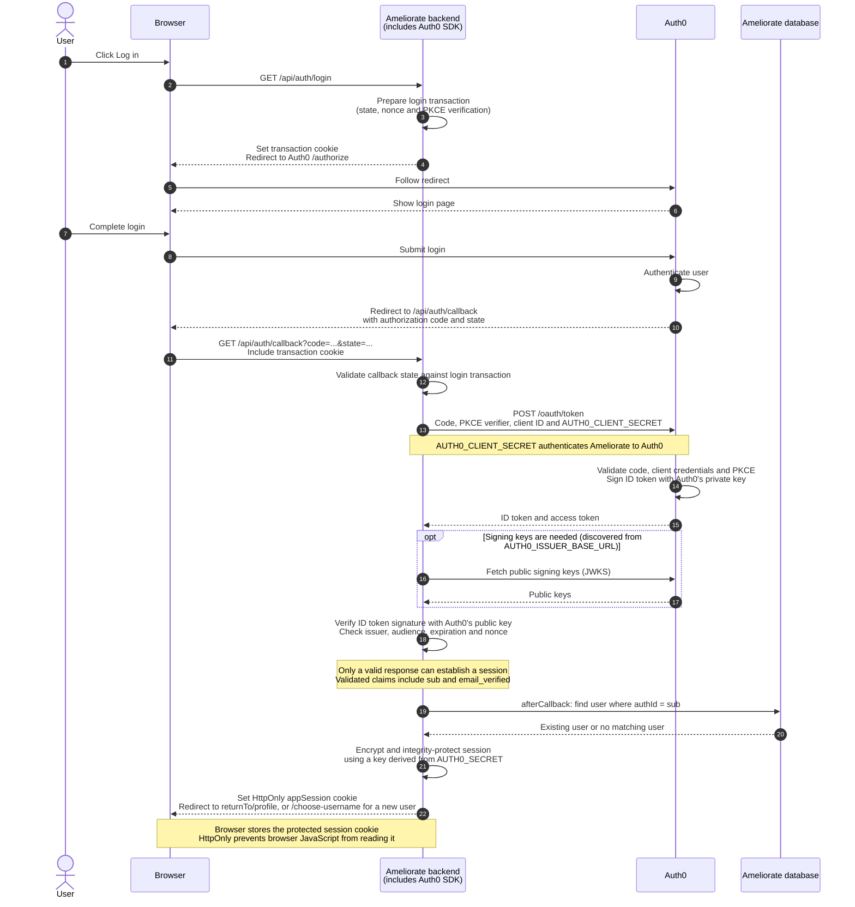
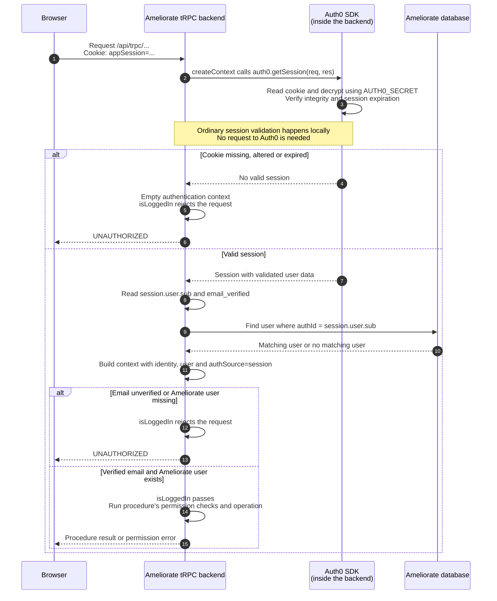

# Authentication flow

Note: this doc is LLM-generated but it seems pretty decent and easy to read.

---

Ameliorate uses `@auth0/nextjs-auth0` v3.6.0. These diagrams show browser login and subsequent session-authenticated tRPC requests, using the SDK's default RS256 token verification and encrypted cookie sessions.

## 1. Login

The backend verifies Auth0's response, then creates an Ameliorate session cookie for the browser.

Auth0's private signing key stays with Auth0. Its public key verifies that the ID token came from the trusted issuer and was not altered. `AUTH0_CLIENT_SECRET` authenticates the application during the token exchange; `AUTH0_SECRET` protects the resulting session cookie.

## 2. Subsequent requests

This example calls a tRPC procedure that uses `isLoggedIn`. The browser automatically sends the session cookie, and the backend verifies it locally before using its user data.

Public procedures can accept an unauthenticated context. Other procedures can use `isAuthenticated` or `isEmailVerified` to require only part of the `isLoggedIn` checks. The SDK can also renew the cookie according to its rolling-session settings.

### Keys and configuration

| Key or setting             | Role                                                                           |
| -------------------------- | ------------------------------------------------------------------------------ |
| `AUTH0_CLIENT_ID`          | Identifies Ameliorate to Auth0; also used to validate the ID token's audience. |
| `AUTH0_CLIENT_SECRET`      | Authenticates Ameliorate to Auth0 during the token exchange.                   |
| Auth0's public signing key | Verifies the ID token's RS256 signature.                                       |
| `AUTH0_SECRET`             | Protects the session cookie against reading and tampering.                     |
| `AUTH0_ISSUER_BASE_URL`    | Identifies the trusted provider used for discovery and token validation.       |

### Project details

- **Local development:** the mock identity provider takes Auth0's place and supplies test identities.
- **Personal access tokens:** a request with a parsed `Authorization: Bearer ...` token takes the separate PAT path. Ameliorate hashes the token and checks its database record, expiry and revocation status. An invalid PAT does not fall back to cookie authentication.

### Code references

- [Auth0 initialization](../src/api/initAuth0.ts)
- [Login and callback route](../src/pages/api/auth/[...auth0].page.ts)
- [Request authentication context](../src/api/context.ts)
- [Authentication middleware](../src/api/auth.ts)
- [PAT verification](../src/api/personalAccessTokenAuth.ts)
- [Local mock provider](../mock-auth/index.ts)

### Auth0 references

- [Authorization Code Flow](https://auth0.com/docs/get-started/authentication-and-authorization-flow/authorization-code-flow)
- [Signing keys](https://auth0.com/docs/get-started/tenant-settings/signing-keys)
- [Next.js authentication and session cookies](https://auth0.com/blog/ultimate-guide-nextjs-authentication-auth0/)
