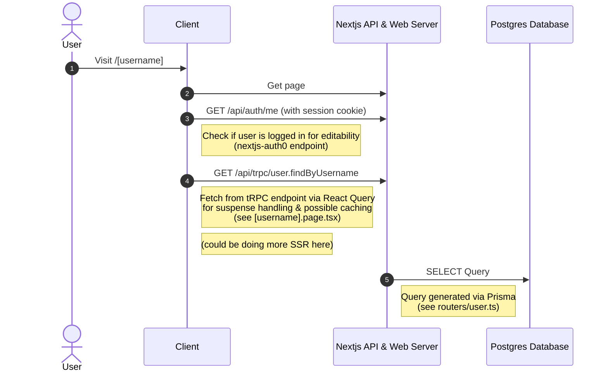
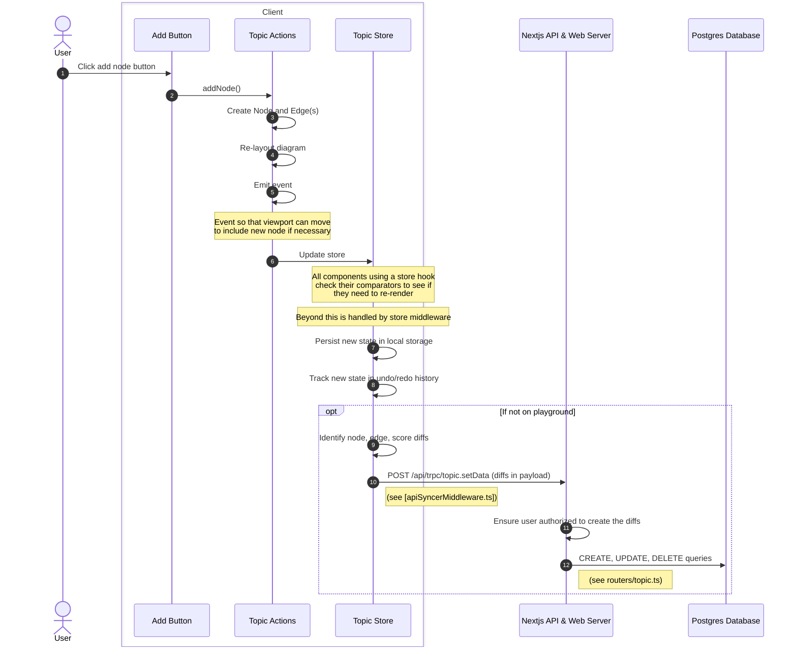

# Data Flow

Here are some diagrams to help provide a high-level overview of how data flows through the app, and to illustrate when some tech comes into play.

## Simple load: user page

## Topic diagram update: add node

