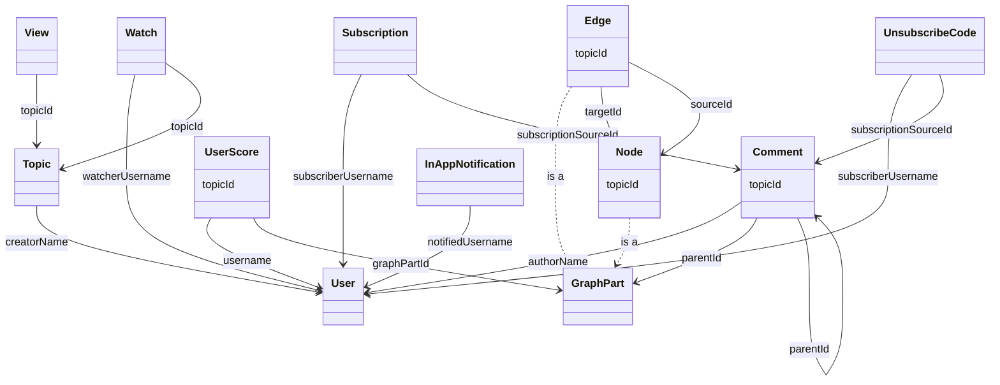

# Database Schema

This is intended to provide a high-level visual of the schema, not to show all of the schema's details.

Could consider using [prisma-erd-generator](https://github.com/keonik/prisma-erd-generator), but some relations are not FKs, and some relations are not that useful to show.

Diagram notes:

- 'GraphPart' refers to Node or Edge; it is not actually its own table.
- Replaced some topic relations with `topicId` attribute to reduce chaotic number of edges.

