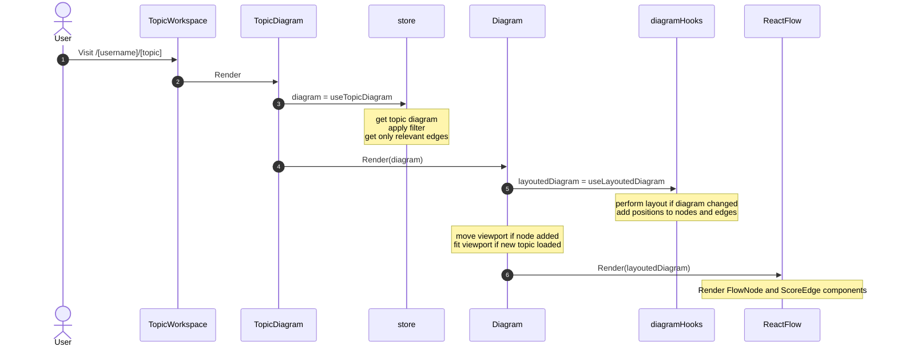

```mermaid
sequenceDiagram
  autonumber
  actor User
  participant TopicWorkspace
  participant TopicDiagram
  participant store
  participant Diagram
  participant diagramHooks
  participant ReactFlow

  User->>TopicWorkspace: Visit /[username]/[topic]
  TopicWorkspace->>TopicDiagram: Render
  TopicDiagram->>store: diagram = useTopicDiagram
  Note over store: get topic diagram<br/>apply filter<br/>get only relevant edges
  TopicDiagram->>Diagram: Render(diagram)
  Diagram->>diagramHooks: layoutedDiagram = useLayoutedDiagram
  Note over diagramHooks: perform layout if diagram changed<br/>add positions to nodes and edges
  Note over Diagram: move viewport if node added<br/>fit viewport if new topic loaded
  Diagram->>ReactFlow: Render(layoutedDiagram)
  Note over ReactFlow: Render FlowNode and ScoreEdge components
```
