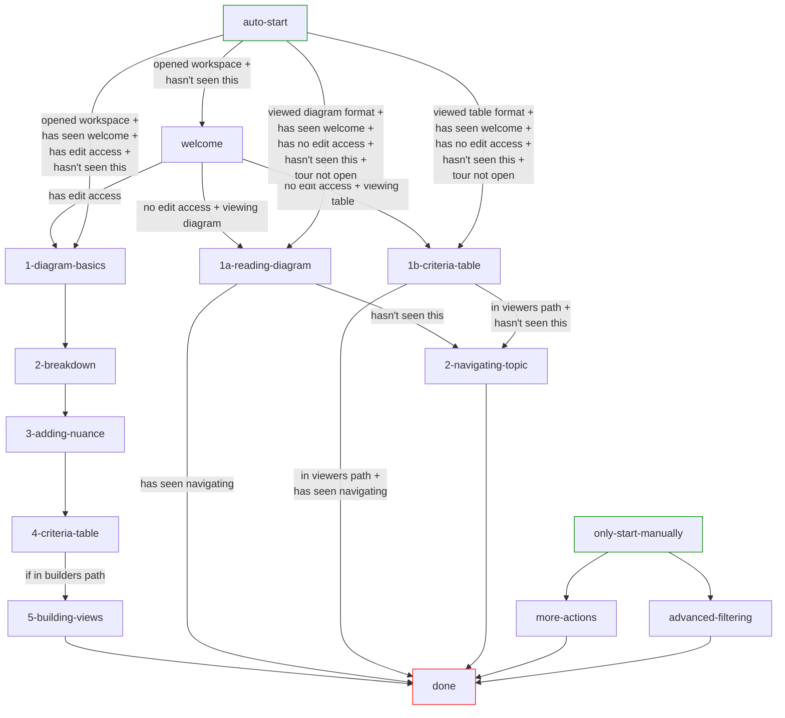

# Tutorial Paths

This gives an overview of the possible ways of starting a tutorial, and which tutorials will continue from the previous.

```mermaid
flowchart TD
    welcome
    only-start-manually
    auto-start
    done

    %% builders
    1-diagram-basics
    2-breakdown
    3-adding-nuance
    4-criteria-table
    5-building-views

    %% viewers
    1a-reading-diagram
    1b-criteria-table
    2-navigating-topic

    %% experts
    more-actions
    advanced-filtering

    auto-start -- opened workspace + <br/> hasn't seen this --> welcome

    welcome -- has edit access --> 1-diagram-basics
    welcome -- no edit access + viewing diagram --> 1a-reading-diagram
    welcome -- no edit access + viewing table --> 1b-criteria-table

    1-diagram-basics --> 2-breakdown
    2-breakdown --> 3-adding-nuance
    3-adding-nuance --> 4-criteria-table
    4-criteria-table -- if in builders path --> 5-building-views
    5-building-views --> done

    1a-reading-diagram -- hasn't seen this --> 2-navigating-topic
    1a-reading-diagram -- has seen navigating --> done
    1b-criteria-table -- in viewers path + <br/> hasn't seen this --> 2-navigating-topic
    1b-criteria-table -- in viewers path + <br/> has seen navigating --> done

    2-navigating-topic --> done

    auto-start -- viewed table format + <br/> has seen welcome + <br/> has no edit access + <br/> hasn't seen this + <br/> tour not open --> 1b-criteria-table
    auto-start -- viewed diagram format + <br/> has seen welcome + <br/> has no edit access + <br/> hasn't seen this + <br/> tour not open --> 1a-reading-diagram
    auto-start -- opened workspace + <br/> has seen welcome + <br/> has edit access + <br/> hasn't seen this --> 1-diagram-basics

    only-start-manually --> more-actions
    more-actions --> done

    only-start-manually --> advanced-filtering
    advanced-filtering --> done

    style only-start-manually stroke:green
    style auto-start stroke:green
    style done stroke:red
```
