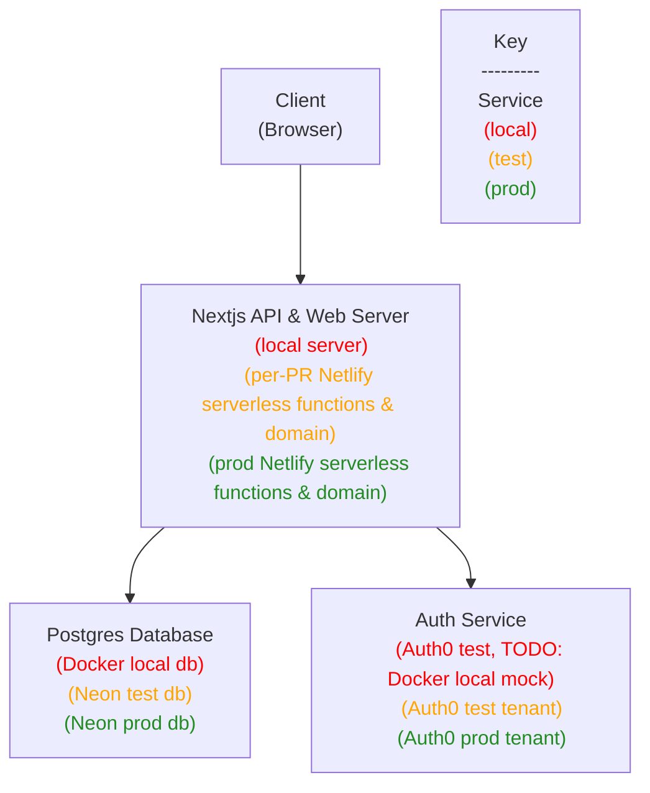

# Architecture by Environment

Here's a diagram of the architecture, along with where each service is hosted, by environment.

```mermaid
flowchart TD
  Client --> Server
  Server --> Database
  Server --> Auth

  Client["
    Client
    (Browser)
  "]
  Server["
    Nextjs API & Web Server
    <font color=red>(local server)</font>
    <font color=orange>(per-PR Netlify serverless functions & domain)</font>
    <font color=forestgreen>(prod Netlify serverless functions & domain)</font>
  "]
  Database["
    Postgres Database
    <font color=red>(Docker local db)</font>
    <font color=orange>(Neon test db)</font>
    <font color=forestgreen>(Neon prod db)</font>
  "]
  Auth["
    Auth Service
    <font color=red>(Auth0 test, TODO: Docker local mock)</font>
    <font color=orange>(Auth0 test tenant)</font>
    <font color=forestgreen>(Auth0 prod tenant)</font>
  "]
  Key["
    Key
    ---------
    Service
    <font color=red>(local)</font>
    <font color=orange>(test)</font>
    <font color=forestgreen>(prod)</font>
  "]
```
