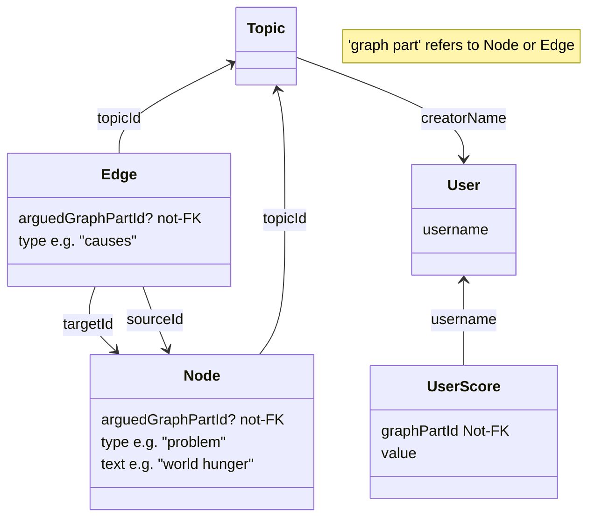

# Database Schema

This is intended to provide a high-level visual of the schema, not to show all of the schema's details. Relation labels are foreign keys.

```mermaid
classDiagram
  Edge --> Node: targetId
  Edge --> Node: sourceId
  User <-- UserScore: username
  Topic <-- Node: topicId
  Topic <-- Edge: topicId
  Topic --> User: creatorName

  class User {
    username
  }

  class Topic {
  }

  class Node {
    arguedGraphPartId? not-FK
    type e.g. "problem"
    text e.g. "world hunger"
  }

  class Edge {
    arguedGraphPartId? not-FK
    type e.g. "causes"
  }

  class UserScore {
    graphPartId Not-FK
    value
  }

  note "'graph part' refers to Node or Edge"
```
